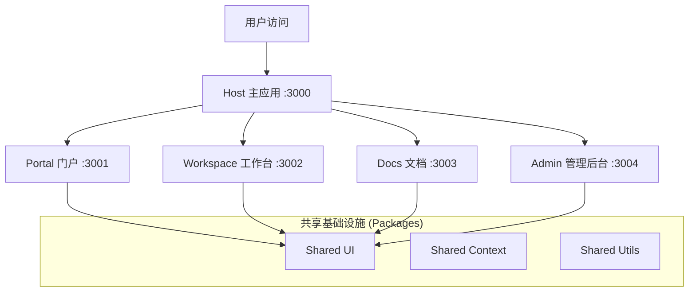

# Collab SaaS - 企业级微前端协作平台

> 基于 Darwin 元能力构建的下一代大型项目协作 SaaS 平台

[](https://github.com/exposir/skill3)
[](LICENSE)
[](https://www.typescriptlang.org/)
[](https://vitejs.dev/)
[](https://react.dev/)

## 📖 项目简介

**Collab SaaS** 是一个高性能、可扩展的企业级项目协作平台。它采用先进的 **微前端 (Micro-frontend)** 架构设计，利用 Vite Module Federation 技术实现多应用聚合。项目旨在通过模块化开发，提供包括项目管理、文档协作、后台管理等全方位的 SaaS 解决方案。

核心设计目标：

- **独立部署**: 各个子应用可独立开发、构建和部署。
- **共享生态**: 建立统一的共享组件库、类型库和工具库。
- **高性能**: 基于 Turborepo 的增量构建和 Vite 的秒级冷启动。

## 🏗 技术架构

本项目采用 Monorepo 策略管理，基于 PNPM Workspaces 和 Turborepo。



### 技术栈

- **构建系统**: Turborepo + PNPM Workspaces
- **开发工具**: Vite 5 + Module Federation
- **前端框架**: React 18 + TypeScript 5.4
- **状态管理**: Zustand
- **路由管理**: React Router 6
- **样式方案**: TailwindCSS (Planned) / CSS Modules

## ✨ 功能特性

### 当前已实现 (Phase 0-1)

- ✅ **微前端架构**: 完整的 Host + Remote 通信机制。
- ✅ **基础模块**: 认证 (Auth) 模块及契约定义。
- ✅ **共享设施**: 类型定义、工具函数、UI 组件库基础设施。
- ✅ **开发体验**: 统一的 lint、typecheck 和 build 命令。

### 规划中 (Phase 2-5)

- 🚧 **多业务应用**: 完整的 Workspace (项目管理), Docs (文档), Admin (后台)。
- 🚧 **高级功能**:
  - 权限管理 (RBAC)
  - 实时协作 (WebSocket)
  - 工作流引擎
  - 仪表盘与报表

详细规划请参阅 [IMPLEMENTATION_PLAN.md](./IMPLEMENTATION_PLAN.md)。

## 🚀 快速开始

### 环境要求

- Node.js >= 18.0.0
- PNPM >= 9.0.0

### 安装

1. **克隆仓库**

   ```bash
   git clone <repository-url>
   cd collab-saas
   ```

2. **安装依赖**

   ```bash
   pnpm install
   ```

   _注意：项目配置了 postinstall 钩子，会自动处理相关依赖。_

3. **启动开发环境**
   ```bash
   pnpm dev
   ```
   这将启动 Turbo 任务，同时拉起所有子应用：
   - Host App: http://localhost:3000
   - Portal App: http://localhost:3001
   - (其他子应用将按需启动)

### 常用命令

| 命令             | 说明                        |
| ---------------- | --------------------------- |
| `pnpm dev`       | 启动开发服务器 (全量)       |
| `pnpm build`     | 构建所有应用和包            |
| `pnpm lint`      | 运行代码风格检查            |
| `pnpm typecheck` | 运行 TypeScript 类型检查    |
| `pnpm clean`     | 清理构建产物和 node_modules |

## 📂 项目结构

```text
collab-saas/
├── apps/                   # 应用目录
│   ├── host/               # [主应用] 负责编排和路由分发
│   ├── portal/             # [子应用] 门户与个人中心
│   ├── workspace/          # [子应用] 核心工作台 (待开发)
│   ├── docs/               # [子应用] 文档知识库 (待开发)
│   └── admin/              # [子应用] 系统管理后台 (待开发)
│
├── packages/               # 共享包目录
│   ├── shared-types/       # 全局 TypeScript 类型定义
│   ├── shared-ui/          # 通用 React 组件库
│   └── shared-utils/       # 公共工具函数库
│
├── turbo.json              # Turborepo 任务流配置
└── pnpm-workspace.yaml     # Monorepo 工作区定义
```

## 🤝 贡献指南

1. 遵循 Semantic Versioning 规范。
2. 提交代码前请确保通过 `pnpm typecheck` 和 `pnpm lint`。
3. 新增模块请参考 `IMPLEMENTATION_PLAN.md` 中的规范。

## 📄 许可证

MIT License
